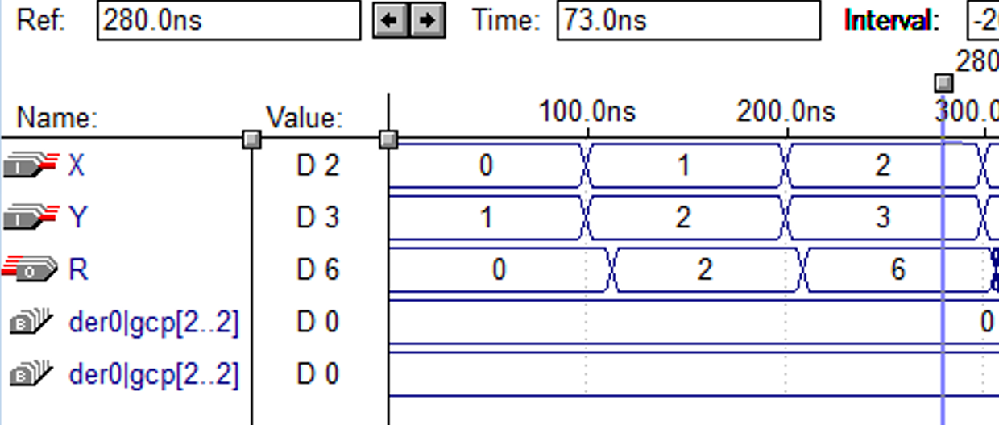
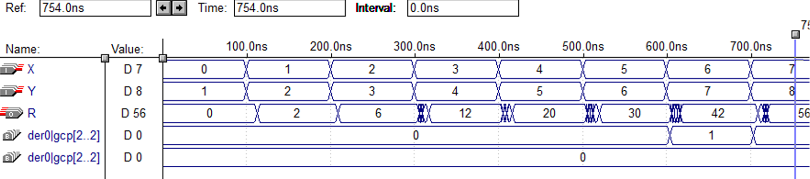

# 4-bit Multiplier

This project implements a 4-bit binary multiplier using VHDL. It performs unsigned multiplication between two 4-bit inputs and returns an 8-bit result. The design demonstrates fundamental digital logic concepts such as partial product generation, bitwise operations, and vector arithmetic.

## Features

- Inputs:
  - `X`: 4-bit unsigned operand
  - `Y`: 4-bit unsigned operand
- Output:
  - `R`: 8-bit product
- Architecture:
  - Generates 4 partial products manually.
  - Combines them using vector arithmetic to produce the final result.

### Examples

## Files

- `multi4.vhdl` – Main VHDL architecture and entity declaration.
- `waveForm.png` – Simulation output showing signal transitions.

## Tools Used

- VHDL-93
- MaxPlus II for design and simulation
